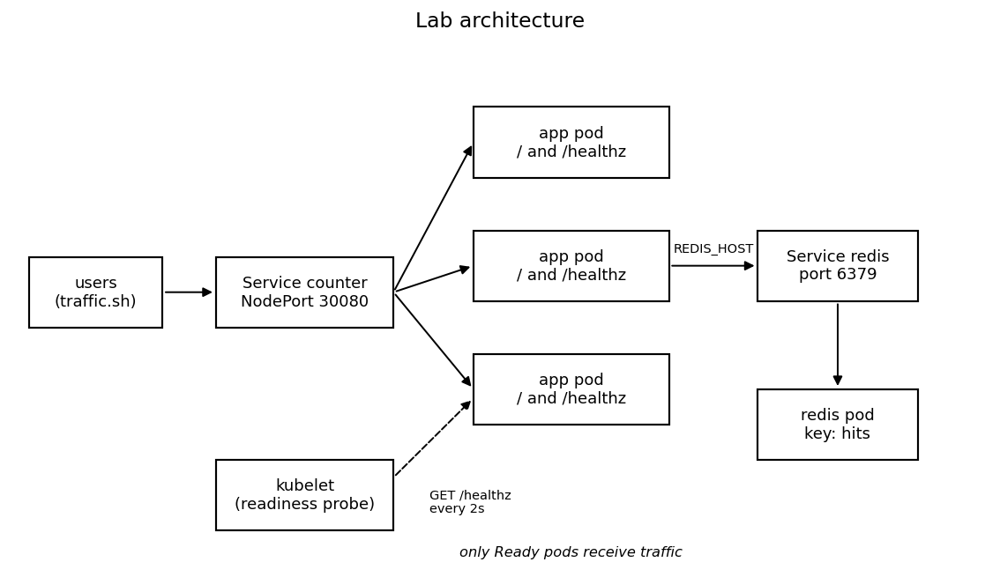

# Safe Releases with Progressive Delivery

Health checks, rollback, and their limits.

The terminal on the right is setting up the lab. It builds the app image and deploys version 1. Wait until it prints "Tutorial environment is ready" before starting step 1.

## Why we made this

A lot of outages happen right after a release. Often a new version is applied and then someone watches the dashboards and hopes everything is fine. If the new version is broken, all users get it at once, and fixing it depends on someone noticing.

The idea of progressive delivery is that a new version reaches users gradually, and something checks on the way if it is safe to continue. In this lab we do the simplest version of that with plain Kubernetes: a rolling update that is gated by a readiness probe, and a small release script that rolls back by itself. After that we break things on purpose to see where this stops working.

## Learning outcomes

After this tutorial you should be able to:

1. Explain how a Deployment replaces pods during a rolling update, and how the readiness probe decides if a new pod gets traffic.
2. Find out why a rollout is stuck (rollout status, pod events, the health endpoint) and roll it back with `kubectl rollout undo`.
3. Automate a release with a script that applies a manifest, waits for a limited time and rolls back if it doesn't finish.
4. Show that a readiness probe only checks what it is told to check, so a rollout can succeed while users get errors.
5. Compare `maxSurge` and `maxUnavailable` settings and explain the trade-off between rollout speed and capacity.
6. Decide when a rolling update with health checks is enough, and when a team needs canary or blue-green releases with metrics.

## How the system looks

Everything runs on a one-node Kubernetes cluster:

- The counter app is a small Flask app (run with gunicorn). `GET /` increments a counter in Redis and returns it together with the version and the pod name. `GET /healthz` pings Redis and returns 200 if it answers, otherwise 503.
- Redis stores the counter. Since the app itself keeps no state, the pods are interchangeable, and an old and a new version can run at the same time and still show the same number.
- A Deployment runs 3 replicas of the app and decides how old pods are replaced.
- A NodePort Service (port 30080) sends each request to one of the pods that are Ready. It selects pods only by the label `app=counter`, so during a release it sends traffic to both versions.
- The kubelet calls `/healthz` on every pod every 2 seconds (readiness probe). A pod that fails is removed from the Service and does not count as progress for the rollout.
- `traffic.sh` plays the users. It sends about 5 requests per second and logs every answer, so after each release we can count what users actually got.

You can open the app [on port 30080]({{TRAFFIC_HOST1_30080}}). The files are in `~/tutorial/assets`: the app code in `app`, the Kubernetes files in `manifests` and our helper scripts in `scripts`. The images are built inside the lab, so you don't need a registry or a Docker Hub account.

## What we will do

| Step | Version | What is special about it |
|---|---|---|
| 1 | v1 | already running, we look at the setup |
| 2 | v2 | a normal, working release |
| 3 | v3 | points to a Redis service that doesn't exist, we roll back by hand |
| 4 | v3 | same failure, but the script rolls back |
| 5 | v4 | `/` is broken but `/healthz` is fine |
| 6 | v3 | same broken release with two rollout strategies |

## How this relates to DevOps

Continuous Delivery is about making releases boring and low risk. That only works if a bad release is stopped automatically and not by someone reacting in a hurry. In this lab we use a few typical DevOps practices: the desired state is described in manifests, readiness probes and a smoke test act as automatic quality gates, the release script gives fast recovery, and every release is written to a log. The last two steps show where these safety nets have gaps, which helps to decide what a team needs on top.

It takes about 45 minutes. Basic shell knowledge is enough, and it helps if you have used `kubectl` before. You can click on the commands to run them.

This lab is temporary, so don't put any secrets or production data in it.

