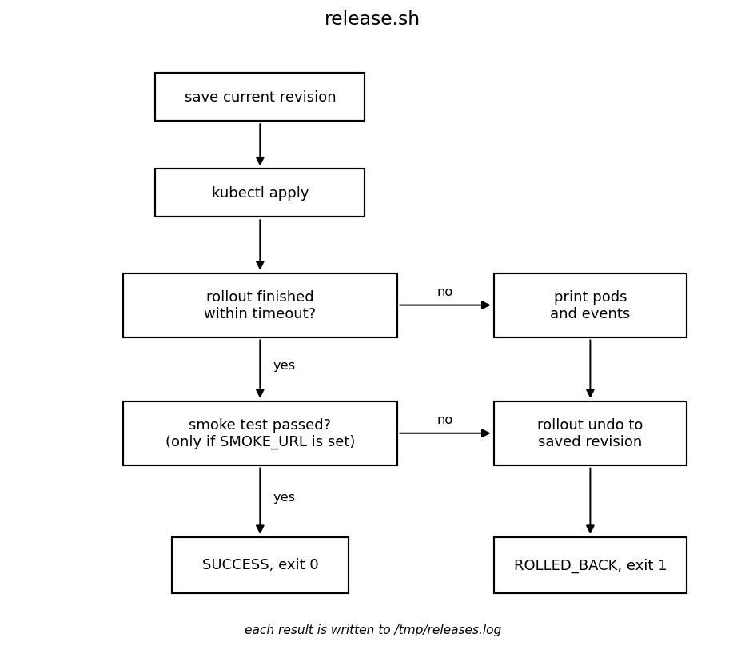

# 4. Automate rollback for the same failure

In step 3 someone had to notice the problem and type `undo`. Now we let a script do that. First have a look at it:

```
cd ~/tutorial
cat assets/scripts/release.sh
```{{exec}}



Some notes on how the script works:

- Before applying, it saves the current revision number and later rolls back to exactly that revision (`--to-revision`). A plain "undo" would just go one step back, which can be the wrong version if the manifest didn't change anything.
- There are two timers. `progressDeadlineSeconds` (60s) in the cluster only reports the failure. The timeout of the script is where the decision is made.
- It prints the pods and the probe events before rolling back, because after the rollback the broken pod is gone.
- It exits with code 1 and writes a line to `/tmp/releases.log`, so a CI/CD pipeline could stop and alert someone.

The v3 image is already loaded. Use the release helper to apply the same broken manifest, wait up to 30 seconds, and automatically undo the change if the rollout does not finish:

```
bash assets/scripts/traffic.sh reset
bash assets/scripts/release.sh assets/manifests/counter-v3.yaml 30s; echo "exit code: $?"
```{{exec}}

The script exits with a failure status after rolling back. That is expected: the release failed, but the running app should be back on v2. Nobody had to type `undo`.

```
kubectl get deployment counter
curl http://127.0.0.1:30080/
cat /tmp/releases.log
bash assets/scripts/traffic.sh summary
```{{exec}}

The log says `result=ROLLED_BACK`, and the users again only got v2 with HTTP 200. This is basically what a CD pipeline would run after every deploy.

Something to think about: the cluster runs v2 now, but `counter-v3.yaml` still says v3. With a GitOps tool like Argo CD or Flux, v3 would just be applied again. So a rollback should also be done in Git, for example by reverting the commit.

Click **CHECK** once the deployment has three ready v2 replicas again.
