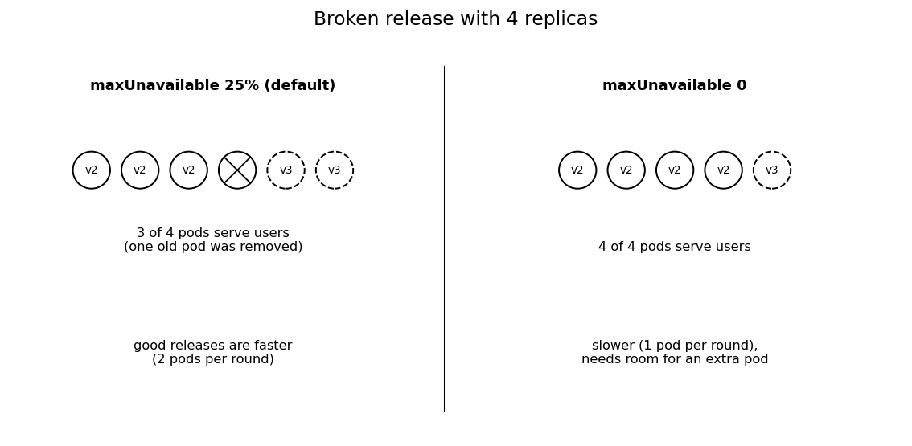

# 6. Compare rollout capacity

The last experiment uses the same unhealthy v3 release with two rolling-update policies.

Before we start, one thing we noticed while building this. Kubernetes turns the 25% into a number of pods, and it rounds `maxSurge` up but `maxUnavailable` down. We have 3 replicas, and 25% of 3 is 0.75, so `maxUnavailable` became 0. That means all our releases so far never removed a pod early, even with the default settings. With 4 replicas, 25% is exactly 1 pod. So for this step we switch to 4 replicas and only change `maxUnavailable`:

| policy | maxSurge | maxUnavailable | with 4 pods |
|---|---|---|---|
| fast (default) | 25% | 25% | 1 extra pod, 1 pod may be missing |
| safe | 1 | 0 | 1 extra pod, never less than 4 |

The manifests for this come from a small template script:

```
cd ~/tutorial
cat assets/scripts/render.sh
```{{exec}}

If `render.sh` reports that `envsubst` is missing, install it with `sudo apt-get update && sudo apt-get install -y gettext-base`, then retry.

## Fast

First we switch to 4 replicas with the fast policy. It's still v2, so nothing gets rolled out here:

```
bash assets/scripts/release.sh "$(bash assets/scripts/render.sh v2 fast)"
```{{exec}}

Render the default-style policy (`fast`) and attempt the broken release. We start it in the background and let the capacity sampler count every second how many pods can take traffic:

```
bash assets/scripts/traffic.sh reset
fast=$(bash assets/scripts/render.sh v3 fast redis-cache)
bash assets/scripts/release.sh "$fast" 30s > /tmp/fast.log 2>&1 &
bash assets/scripts/capacity.sh 30
```{{exec}}

Write down the `lowest` value at the end. The release helper should time out and roll back. `wait` waits for it to finish:

```
wait; tail -3 /tmp/fast.log
```{{exec}}

## Safe

After v2 is healthy again, run the sampler for the `safe` policy and repeat (now with `maxUnavailable: 0`):

```
bash assets/scripts/release.sh "$(bash assets/scripts/render.sh v2 safe)"
safe=$(bash assets/scripts/render.sh v3 safe redis-cache)
bash assets/scripts/release.sh "$safe" 30s > /tmp/safe.log 2>&1 &
bash assets/scripts/capacity.sh 30
```{{exec}}

```
wait; tail -3 /tmp/safe.log
```{{exec}}

## Results

Both attempts fail because v3 cannot reach Redis. Compare the lowest `available` count printed by each sampler. The fast policy allows some unavailability; the safe policy sets `maxUnavailable: 0` and waits for a replacement to become ready before removing an old replica.



When we ran it, fast went down to 3/4 and safe stayed at 4/4. With fast, Kubernetes threw away a working pod before it even knew if v3 works. What about the users? After both experiments, inspect the traffic results:

```
bash assets/scripts/traffic.sh summary
```{{exec}}

No failed requests either way. Nobody saw an error, but with fast we lost a quarter of our pods until the rollback, and nothing told us. Here with 5 requests per second it doesn't matter. With real traffic the remaining three pods would each get about a third more load, and a release that is "just stuck" could suddenly overload them.

So should you always use safe? We don't think so. Fast is quicker when the release is fine, because it swaps two pods at a time instead of one. And safe needs room in the cluster for an extra pod, if the cluster is full you can only roll out by removing pods first. On the other hand, rolling back from safe is quicker, since all old pods are still running.

In short: if capacity is tight or you only have a few replicas, go with `maxUnavailable: 0`. If speed matters more and you have spare capacity, some unavailability is fine. In both cases the automatic rollback keeps the bad state short.

Finally, stop the traffic generator:

```
bash assets/scripts/traffic.sh stop
```{{exec}}

Click **CHECK** after the automatic rollback leaves v2 healthy.
